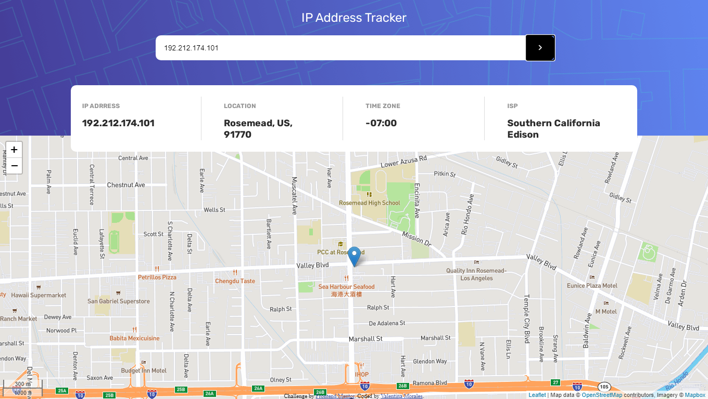

# ip-address-tracker from Frontend Mentor Challenges

This is a solution to the [IP address tracker challenge on Frontend Mentor](https://www.frontendmentor.io/challenges/ip-address-tracker-I8-0yYAH0). Frontend Mentor challenges help you improve your coding skills by building realistic projects. 

## Overview

## The challenge

The challenge is to build out this IP Address Tracker app and get it looking as close to the design as possible. To get the IP Address locations, you'll be using the [IP Geolocation API by IPify](https://geo.ipify.org/). To generate the map, I use [LeafletJS](https://leafletjs.com/).

You should be able to:

- View the optimal layout for each page depending on their device's screen size
- See hover states for all interactive elements on the page
- See their own IP address on the map on the initial page load
- Search for any IP addresses and see the key information and location

---

⚠️ **IMPORTANT** ⚠️: To use the IP Geolocation API by IPify, you'll need to sign up for a free account. You won't need to add any cards details to do this and it's a very quick process. This will generate an API Key for you. Usually, you would be able to restrict your API Key to a specific URL (your own domain). This makes sure that other people can't use your API Key on their own websites. IPify doesn't have this feature, but because you aren't adding your card details, this isn't an issue. **So be sure to only sign up for the free account and DO NOT enter any card details**.

### Screenshot

## My process

### Built with

- Semantic HTML5 markup
- CSS custom properties
- Flexbox
- CSS Grid
- JavaScript

## Author

- Website - [valentinacmp](https://github.com/valentinacmp)
- Frontend Mentor - [@valenmp](https://www.frontendmentor.io/profile/valenmp)
